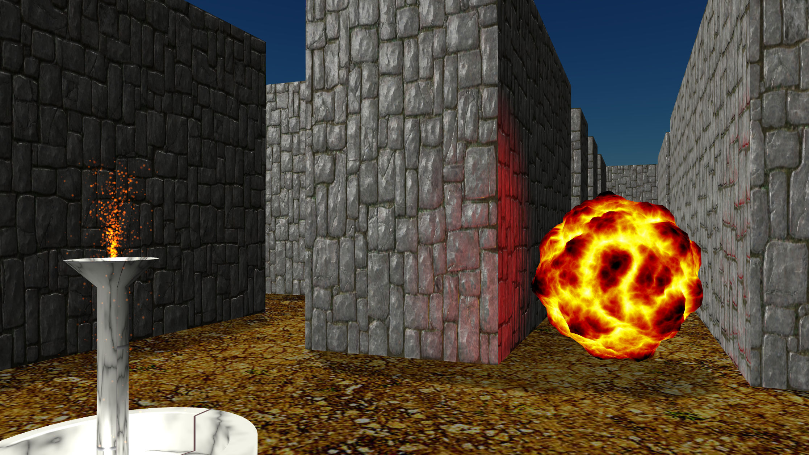

:doctype: book

image:https://github.com/toedter/maze-of-delon/workflows/Build/badge.svg["build", link="https://github.com/toedter/maze-of-delon/actions"]
image:https://img.shields.io/badge/license-MIT-blue.svg["MIT", link="http://toedter.mit-license.org"]

= The Maze of Delon

The Maze of Delon is my first experiment with https://babylonjs.com[Babylon.js] and https://doc.babylonjs.com/divingDeeper/webXR/introToWebXR[Web based Virtual Reality (WebXR)].
This is in a very early stage, please stay tuned.

== Demo

Here you find a demo of the current snapshot.
You control the camera with the mouse, and the cursor keys.

When you have a Virtual Reality Headset running, you can click on
the icon in the bottom right corner to enable VR.

|===
| Snapshot |  https://toedter.github.io/maze-of-delon[Maze of Delon Demo]
|===

== Development Server

Run `npm start` for a dev server. Navigate to http://localhost:8080/.
The app will automatically reload if you change any of the source files.

== Build

Run `npm run build` to build the project in production mode.
The build artifacts will be stored in the `dist/` directory.

== Acknowledgements

* Background music
** Song : Nyoko - Flowing Into The Darkness
** promoted by MUSIC FOR YOUTUBE https://youtu.be/p-S83Dqxq4g
* Win sound:
** By xtrgamr
** https://freesound.org/people/xtrgamr/sounds/244536/ licensed under https://creativecommons.org/licenses/by/3.0/[CC-BY 3.0]
* Lose sound:
** By LittleRobotSoundFactory
** https://freesound.org/people/LittleRobotSoundFactory/sounds/270529/ licensed under https://creativecommons.org/licenses/by/3.0/[CC-BY 3.0]
* All textures and assets by Babylon.js or provided by Babylon.js community

[[license]]
== License

MIT, see http://toedter.mit-license.org
